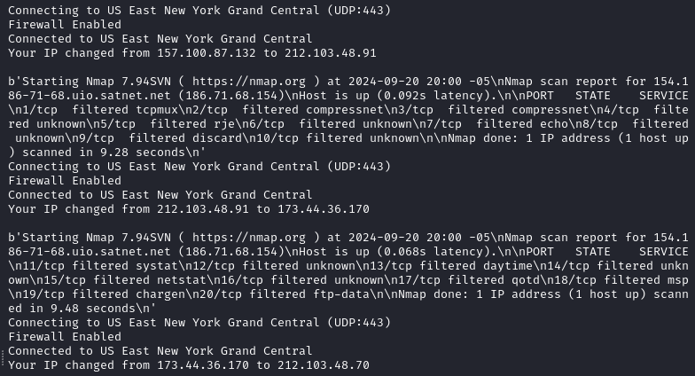

Here’s the `README.md` file for your project named **bypassWAF**, incorporating the requirement to use Windscribe on Linux:

---

# bypassWAF



**bypassWAF** is a tool that includes two Python scripts designed to perform port scanning with Nmap, changing the IP address after every 10 ports scanned. The second script saves the scan results, categorizing the ports as open, closed, or filtered. This tool requires the Windscribe VPN client to be installed on your Linux system.

## Scripts

### 1. **vpn.py**: Scans ports and changes the IP address after every 10 ports.
### 2. **vpn2.py**: Scans ports, changes the IP address after every 10 ports, and saves the results as open, closed, or filtered ports.

---

## Requirements

1. Python 3.x
2. `nmap` (must be installed on the system)
3. Windscribe VPN (must be installed on Linux)

---

## Installation of Windscribe

To install Windscribe on Linux, follow these steps:

1. Download the Windscribe Linux client from the [official website](https://windscribe.com/download).
2. Follow the installation instructions provided on the website.

---

## Usage

### 1. vpn.py

This script scans a target's ports while changing the IP address after every 10 scanned ports.
You have to modify the file and change the IP.

**Usage**:

```bash
python vpn.py
```


### 2. vpn2.py

This script performs the same port scan as `vpn.py` but also saves the results of open, closed, or filtered ports in an output file. You have to modify the file and change the IP.

**Usage**:

```bash
python vpn2.py
```

## Disclaimer

This tool is intended for educational and ethical hacking purposes only. Use it responsibly and ensure you have permission to scan any network or device.

--- 

Feel free to modify any sections to better fit your project!
